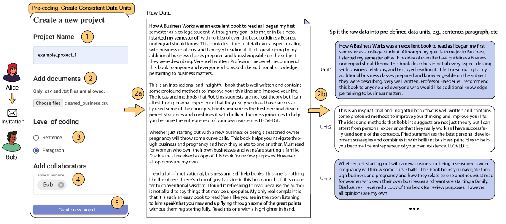

CollabCoder is a lower-barrier, rigorous workflow for inductive collaborative qualitative analysis. The workflow consists of three key stages:

-   **Independent Open Coding**, facilitated by on-demand code suggestions from LLMs, producing initial codes;
-   **Iterative Discussion**, focusing on conflict mediation within the coding team, producing a list of agreed-upon code decisions;
-   **Codebook Development**, where code groups may be formed through LLM-generated suggestions, based on the list of decided codes in the previous phase.

<iframe width="628" height="352" src="https://www.youtube.com/embed/C3n4UvMHgIY?si=8d1f-mT5irkK0N9z" title="YouTube video player" frameborder="0" allow="accelerometer; autoplay; clipboard-write; encrypted-media; gyroscope; picture-in-picture; web-share" referrerpolicy="strict-origin-when-cross-origin" allowfullscreen></iframe>

<!--  
 
<h2>Precoding</h2> Establish consistent data units and enlist coding team during project creation. The primary coder, Alice, can: 1) name the project, 2) incorporate data, ensuring it aligns with mutually agreed data units, 2a) illustrate how CollabCoder manages the imported data units, 3) define the coding granularity (e.g., sentence or paragraph), 4) invite a secondary coder, Bob, to the project, and 5) initiate the project.

 
 
<h2>Editing Interface for Phase 1</h2> 1) Inputting customized code for the text in "Raw Data", either 1a) choosing from the GPT’s recommendations, 1b) choosing from the top three relevant codes; 2) adding keywords support by 2a) selecting from raw data and "Add As Support"; 3) assigning a certainty level ranging from 1 to 5, where 1="very uncertain" and 5="very certain"; and 4) reviewing and modifying the individual codebook.

 
 
<h2>Comparison Interface for Phase 2</h2>
Users can discuss and reach a consensus by following these steps: 1) reviewing another coder’s progress and 1a) clicking on the checkbox only if both individuals complete their coding, 2) two coders’ codes are listed in the same interface, 3) calculating the similarity between code pairs and 3a) IRR between coders, 4) sorting the similarity scores from highest to lowest and identifying (dis)agreements, and 4a) making a decision through discussion based on the initial codes, raw data, and code supports or utilizing the GPT’s three potential code decision suggestions. Additionally, users have the option to "Replace" the original codes proposed by two coders and revert back to the original codes if required. They can also replace or revert all code decisions with a single click on the top bar.

 
 
<h2>Code Group Interface for Phase 3</h2> It enables users to manage their code decisions in a few steps: 1) the code decisions are automatically compiled into a list of unique codes that users can edit by double-clicking and accessing the original data by hovering over the code. 2) users can group their code decisions by using either "Add New Group" or "Create Code Groups By AI" options. They can then 2a) name or delete a code group or use AI-generated themes, and 2b) drag the code decisions into code groups. 3) Finally, users can save and update the code groups.

 -->
