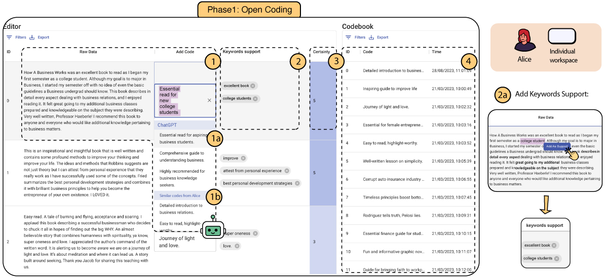
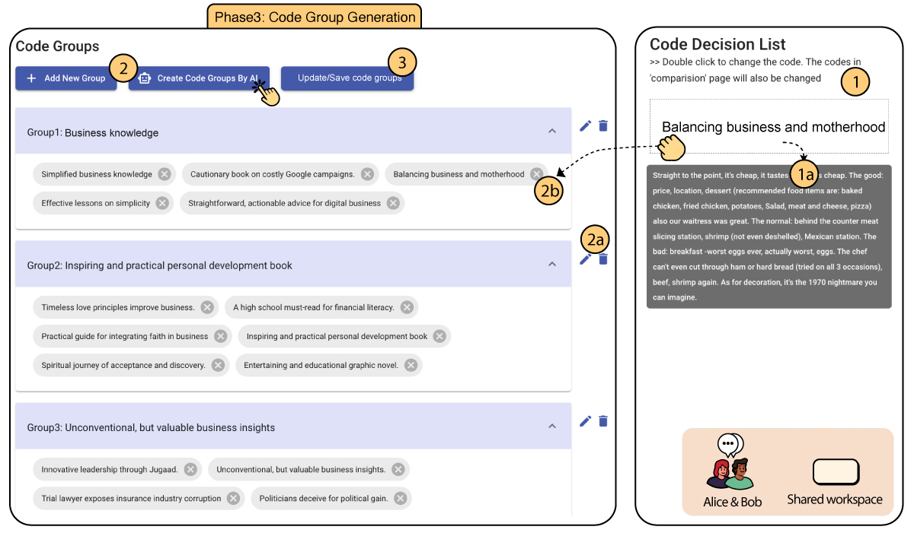

  <iframe src="https://www.youtube.com/embed/C3n4UvMHgIY?si=8d1f-mT5irkK0N9z" title="CollabCoder Demo Video" allow="accelerometer; autoplay; clipboard-write; encrypted-media; gyroscope; picture-in-picture; web-share" referrerpolicy="strict-origin-when-cross-origin" allowfullscreen></iframe>

## Overview

CollabCoder is a lower-barrier, rigorous workflow for **inductive collaborative qualitative analysis**. By integrating Large Language Models into the coding process, CollabCoder helps research teams achieve higher quality and more efficient qualitative analysis.

  

    
1

    <h3>Independent Open Coding</h3>
    
On-demand code suggestions from LLMs help coders produce initial codes with higher confidence.

  

  

    
2

    <h3>Iterative Discussion</h3>
    
Conflict mediation within the coding team produces a list of agreed-upon code decisions.

  

  

    
3

    <h3>Codebook Development</h3>
    
LLM-generated suggestions help form code groups based on the decided codes.

  

## Phase 1: Editing Interface

Coders can input customized codes for raw data, choose from GPT recommendations or top relevant codes, add keyword support, assign certainty levels (1-5), and review their individual codebook.

<figure class="figure">
  
  <figcaption>The editing interface supports independent open coding with AI-assisted suggestions.</figcaption>
</figure>

## Phase 2: Comparison Interface

Two coders' codes are displayed side-by-side. The system calculates similarity between code pairs and Inter-Rater Reliability (IRR), helping teams identify agreements and resolve disagreements through discussion or GPT-suggested decisions.

<figure class="figure">
  
  <figcaption>The comparison interface facilitates consensus-building between coders.</figcaption>
</figure>

## Phase 3: Code Group Interface

Code decisions are compiled into unique codes. Users can group them manually or use AI-generated themes, drag codes into groups, and save the final codebook.

<figure class="figure">
  
  <figcaption>The code group interface enables efficient codebook development.</figcaption>
</figure>
